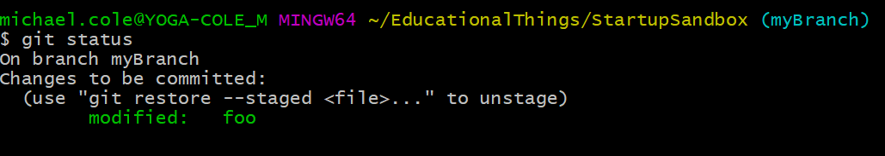

**Using GitHub with EducationalThings @ HCRHS**

**Our Organization**

Hunterdon Central Regional High School has been setup as an Organization in Github.

 

You will need to be added as a member of that organization.

And, you will need to create an account on github.com.

**Repositories**

**Note:  The commands below for clone and push use ssh syntax versus https.  This is because of the use of multiple git accounts.  If you are only using 1 account, you can substitute the "git@github-HCRHS" with** [**git@github.com**](mailto:git@github.com) ** or you could choose to use the https syntax from the repository on github.**

To get a copy of the repository you will be working on:

  

The above command will create a directory with the name of the project.  In this case "StartupSandbox".

You will need to change directory to StartupSandbox

 

This puts you in the directory.  And you see all the code.

You will need to create a branch to work in that is not the master branch.  For example create "myBranch".

 

If you already have the branch myBranch, you need to check it out to make sure that is the branch you are working on.  You can see below the "git branch" command will give you the branch list.  "git checkout myBranch" sets the branch you are working on.

 

Edit the files you need to change.  In the StartupSandbox there is a file foo.   Once you have changed a file you need to add it to the git list of things changed.  You can see the fact that you have files that you changed and haven't added by using git status.

 

You see the file foo in red.  This means it need to be added to the git repository.

 

Now git a git status will recognize that it changed.

 

Once done making a collection of changes, you will want to commit the changes to the branch.

 

You now need to push your changes to the github version from your committed local version.

 

After the "git push" above there are parameters "—set-upstream origin myBranch"  this will link the new myBranch to the origin/master.  After you do this, you will not need to include.

The branch in github repository will now have a copy of the code.  The master branch will still not.

To promote the code from myBranch to master you will do the following.

First, you will need to checkout master.

 

Then you merge myBranch into master.

 
 

Now you need to push that into the github.

 

**MULTIPLE GIT ACCOUNTS**

If you need to work with multiple github accounts, the link below shows you how to set them up.

[https://gist.github.com/JoaquimLey/e6049a12c8fd2923611802384cd2fb4a](https://gist.github.com/JoaquimLey/e6049a12c8fd2923611802384cd2fb4a)